# Research Paper

Name: Neel Patel \
Semester: Spring 2023 \
Topic: A Comparative Analysis of A\* Algorithm Using Different Heuristics on Various Grid Sizes for Pathfinding in a Two-Dimensional Environment
Link The Repository: [Repo Link](https://github.com/Spring23-CS5008-BOS-Lionelle/research-project-neelthepatel8)

## Introduction

[Pathfinding] is a crucial task in computer science, with a wide range of applications in areas such as robotics, video games, and logistics. [A\*] is a popular algorithm used for pathfinding, and it combines elements of [Dijkstra's] algorithm and heuristic search. The algorithm uses a heuristic function to guide the search towards the goal, resulting in more efficient search times than traditional algorithms.

The was first described by Peter Hart, Nils Nilsson, and Bertram Raphael in [1968]. It is an extension of the Dijkstra's algorithm that is optimized by using [heuristics] to guide the search.

The heuristic function is a critical component of A\* and it estimates the cost of the cheapest path from the current node to the goal node. There are many different types of heuristics that can be used, including [Euclidean] distance, [Manhattan] distance, [Chebyshev] distance, [Octile] distance, and many others. Each heuristic has its own strengths and weaknesses, and the choice of heuristic can significantly impact the efficiency and accuracy of the algorithm.

Despite its age, A* remains one of the most popular and effective pathfinding algorithms in use today.
However, the performance of A* can be greatly affected by the choice of heuristic function.

The way that I understood how the A star algorithm works is this - The algorithm is basically the same as Dijkstra's. Dijkstra's uses the weight of 2 elements to decide if it wants to go there. That makes it search all the extra paths that it never needs to search. The brilliance of A\* is that it adds another metric here called the H-Score. H-Score is basically a an estimated distance from the final end point. It is determined by a heuristic function. The actual score from one point to another is called the G-Score, which is what Dijkstra's uses. We combine the H-Score and the G-Score and make up a final F-Score. This is the score that is used by the A star algorithm.

$$ f(x) = g(x) + h(x) $$

Please refer to the below image for more visual guide on the process:
The orange numbers are the H-Score (roughly the distance from that point to the end point), the blue numbers are the G-Score (1 for all blocks)
and the purple are the F-Score.
 
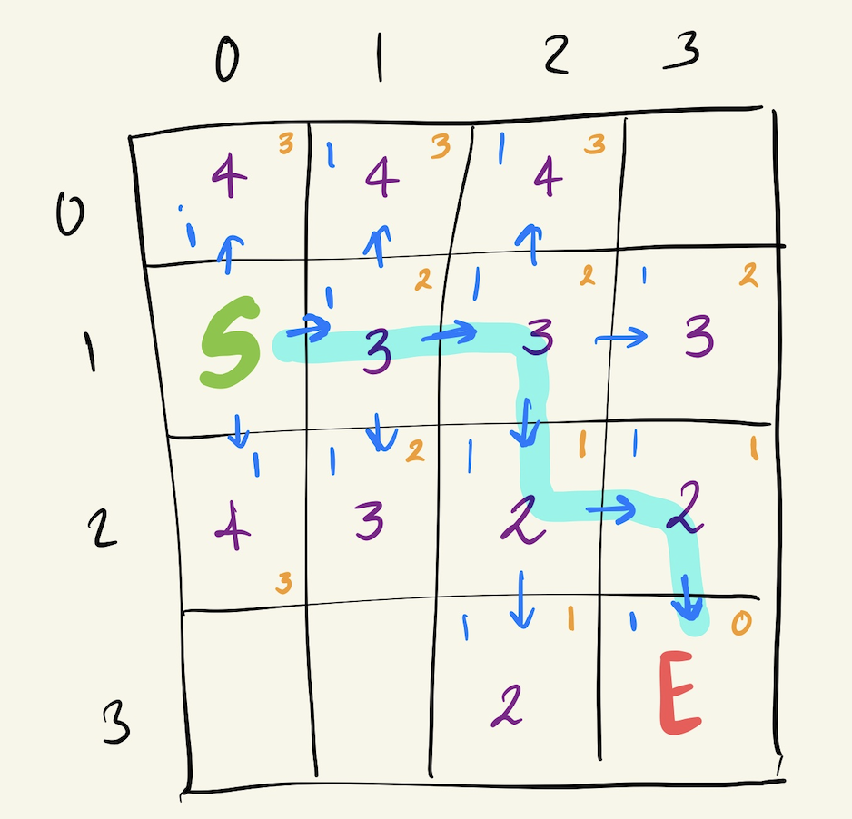

In this project, we aim to analyze the impact of different heuristic functions on the performance of A\* pathfinding algorithm. We will be exploring different heuristic functions such as the Manhattan distance, Euclidean distance, Diagnol distance, and Octile distance. We will also be considering the effects of grid size and starting positions on the performance of the algorithm.

Our analysis will focus on three main performance metrics: time taken to find the optimal path, number of nodes expanded, and path length. We will be comparing the results obtained from different heuristic functions and grid sizes to determine the most efficient combination. Ultimately, our findings can help in the development of more efficient pathfinding algorithms, leading to improved performance in various applications.

## Visualization:

I also implemented a pygame visualizer for the algorithm. It allows for better visuals than the terminal and allows you to create obstacles in a much more intuitive manner. This visualizer can be accessed by this file:
[Visualizer](visualization/main_game.py)

For terminal visualization, I used terminal color codes to show paths, open cells, barriers and explored nodes.

## Analysis of Algorithm/Datastructure

### Time Complexity:

The time taken to perform the A\* algorithm is directly proportional to the size of the grid which clearly makes sense because the algorithm has to search more blocks since we assume the end point is always in the corner.

In terms of the heuristic function, the Manhattan distance and octile distance consistently perform better than the other two heuristics across all grid sizes. This can be attributed to the fact that they tend to underestimate the actual distance to the goal and thus allow the algorithm to explore fewer nodes, leading to faster convergence. On the other hand, the Euclidean distance and diagonal distance tend to overestimate the distance, leading to a larger number of nodes being explored and slower convergence.

It is interesting to note that for smaller grid sizes (up to 30x30), the differences in time taken by the different heuristics are relatively small. However, as the grid size increases, the differences become more significant. Therefore, choosing an appropriate heuristic function can have a significant impact on the performance of the A\* algorithm for larger grids.

- Space Complexity
  The space complexity of A* algorithm depends on the data structures used for implementing the open and closed lists. In the worst case, where all nodes have to be stored in the open list before finding the goal node, the space complexity of A* can be exponential. However, in practice, A\* algorithm typically uses a priority queue for the open list and a hash table or set for the closed list, which reduces the space complexity to $O(b^d)$, where b is the branching factor and d is the depth of the shallowest goal node.

The space complexity can be further reduced by using techniques such as iterative-deepening A* or memory-bound-search. In iterative deepening A*, the algorithm performs a series of depth-limited searches with increasing depth bounds, which reduces the memory requirements at each iteration. In memory-bounded search, the algorithm limits the size of the open list by deleting the nodes with the highest heuristic values when the memory limit is reached.

### Visual paths explored and nodes looked at for different Heuristic functions:

_Constants:_

- Size of grid: 20 x 20
- Start point: Middle of the grid
- Barriers: random 3 walls in the grid
- End point: Bottom right corner of the grid

_Legend:_

- Purple o: represent a visited node
- Green X: represent the correct path found
- Red 1: represent obstacles

<table align="center">
  <tr>
    <td>Manhattan</td>
    <td>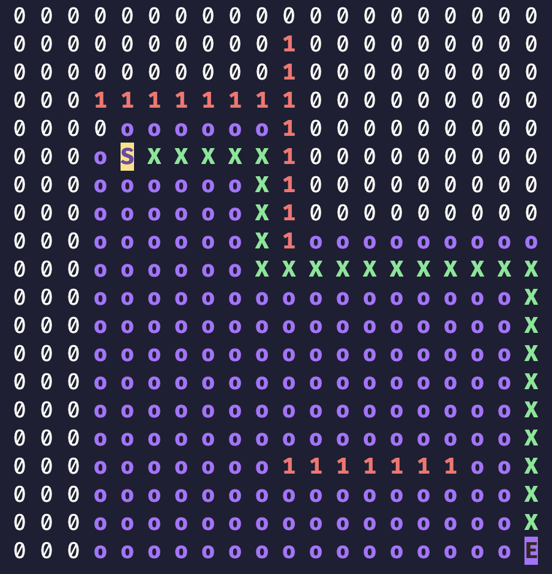</td>
    <td>Euclidean</td>
    <td>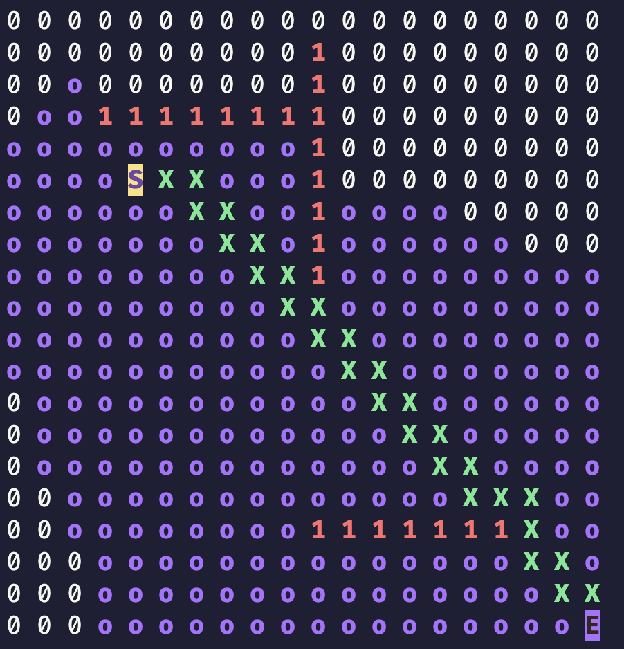</td>
  </tr>
  <tr>
    <td>Diagnol</td>
    <td>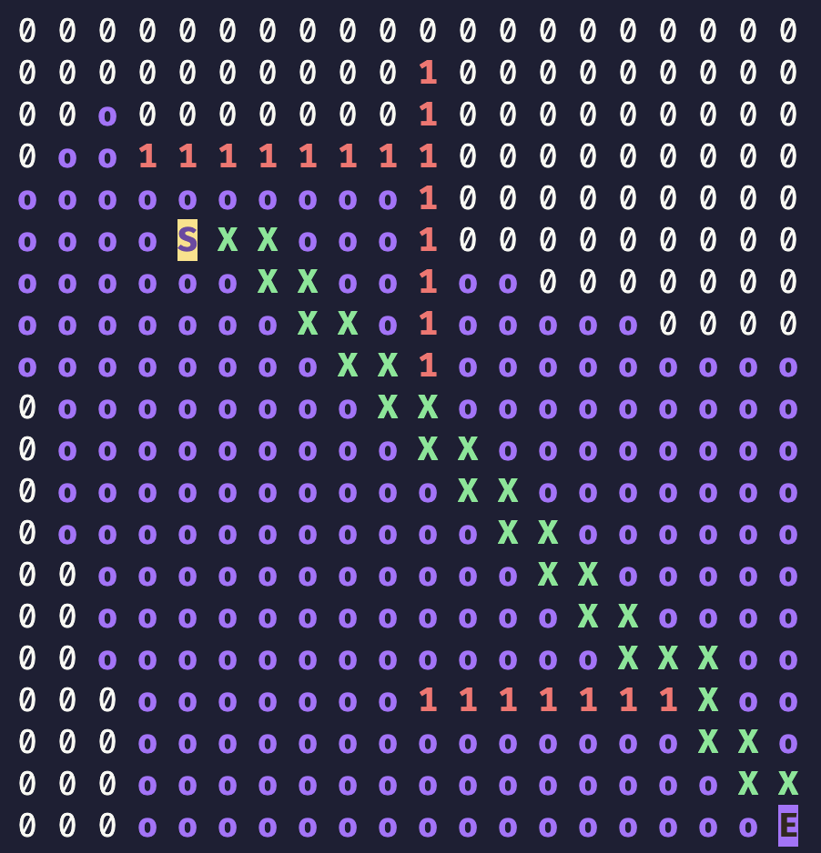</td>
    <td>Octile</td>
    <td>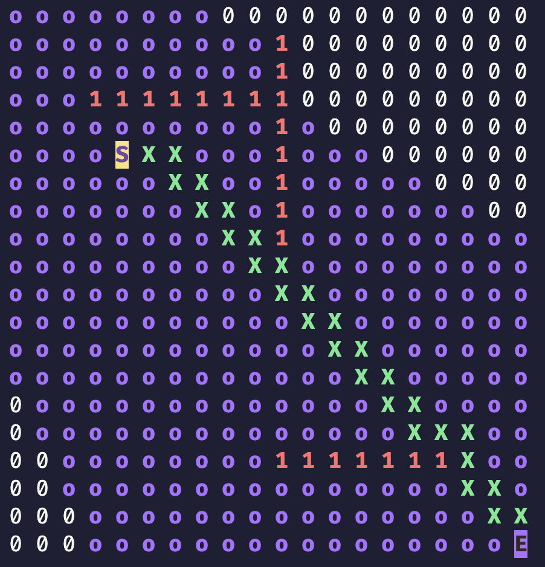</td>
  </tr>
</table>

#### Maze with Manhattan:

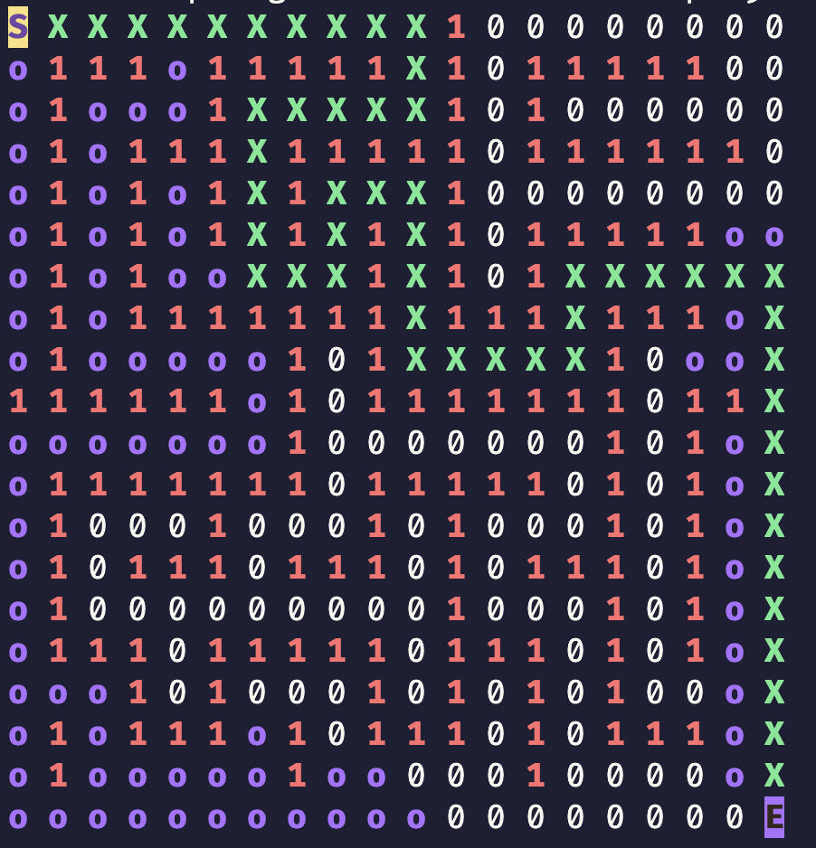

## Empirical Analysis

Empirical analysis is a methodology used to analyze the behavior and performance of algorithms or systems by conducting experiments, collecting data, and drawing conclusions based on observations. Unlike theoretical analysis, which uses mathematical formulas and proofs to evaluate the performance of an algorithm, empirical analysis involves running the algorithm on actual data and measuring its behavior in terms of time, memory usage, and other relevant metrics.

### Grid size v/s Number of nodes explored by the algorithm:

| Grid Size | Manhattan Distance | Euclidian Distance | Diagnol Distance | Octile Distance |
| :-------- | :----------------- | :----------------- | :--------------- | :-------------- |
| 10        | 24                 | 28                 | 26               | 33              |
| 20        | 99                 | 126                | 118              | 150             |
| 30        | 224                | 294                | 278              | 350             |
| 40        | 399                | 536                | 504              | 633             |
| 50        | 624                | 856                | 798              | 1000            |
| 60        | 899                | 1229               | 1159             | 1450            |
| 70        | 1224               | 1693               | 1587             | 1983            |
| 80        | 1599               | 2225               | 2083             | 2600            |
| 90        | 2024               | 2827               | 2645             | 3300            |
| 100       | 2499               | 3489               | 3275             | 4083            |
| 110       | 3024               | 4243               | 3971             | 4950            |
| 120       | 3599               | 5057               | 4735             | 5900            |
| 130       | 4224               | 5938               | 5566             | 6933            |
| 140       | 4899               | 6900               | 6464             | 8050            |
| 150       | 5624               | 7938               | 7430             | 9250            |
| 160       | 6399               | 9038               | 8462             | 10533           |
| 170       | 7224               | 10214              | 9562             | 11900           |
| 180       | 8099               | 11456              | 10728            | 13350           |
| 190       | 9024               | 12786              | 11962            | 14883           |
| 200       | 9999               | 14161              | 13263            | 16500           |

From the table, we can observe that the number of nodes expanded increases as the size of the map increases for all distance metrics. This is expected as larger maps require more nodes to be explored in order to find the optimal path.

We can also see that for all map sizes, the Octile Distance heuristic results in the highest number of nodes expanded. This is likely due to the fact that it considers both horizontal and vertical distances as well as diagonal distances, resulting in a larger search space.

On the other hand, the Manhattan Distance heuristic generally results in the lowest number of nodes expanded. This is because it only considers horizontal and vertical distances, resulting in a smaller search space.

The Euclidean and Diagonal Distance heuristics perform somewhere in between, with Euclidean Distance performing better on larger maps and Diagonal Distance performing better on smaller maps. This is likely due to the fact that Euclidean Distance considers straight-line distances, which become more useful as the search space increases, while Diagonal Distance allows for more direct diagonal movement, which is more useful in smaller search spaces.

### Grid size v/s Size of the path generated:

| Grid Size | Manhattan Distance | Euclidian Distance | Diagnol Distance | Octile Distance |
| :-------- | :----------------- | :----------------- | :--------------- | :-------------- |
| 10        | 18                 | 18                 | 18               | 18              |
| 20        | 42                 | 42                 | 54               | 46              |
| 30        | 78                 | 70                 | 170              | 74              |
| 40        | 138                | 158                | 186              | 110             |
| 50        | 186                | 194                | 166              | 234             |
| 60        | 222                | 218                | 342              | 150             |
| 70        | 398                | 330                | 498              | 370             |
| 80        | 322                | 770                | 330              | 794             |
| 90        | 242                | 390                | 470              | 646             |
| 100       | 334                | 306                | 434              | 558             |
| 110       | 434                | 542                | 474              | 314             |
| 120       | 398                | 506                | 450              | 726             |
| 130       | 810                | 886                | 738              | 542             |
| 140       | 1610               | 650                | 1158             | 1398            |
| 150       | 694                | 2474               | 746              | 1238            |
| 160       | 1970               | 1166               | 606              | 846             |
| 170       | 734                | 1298               | 906              | 1006            |
| 180       | 1762               | 1226               | 1962             | 1038            |
| 190       | 1094               | 1142               | 1398             | 1862            |
| 200       | 1090               | 1114               | 1722             | 1810            |

The table shows the size of the path generated for four different distance measures: Manhattan Distance, Euclidean Distance, Diagonal Distance, and Octile Distance. As the grid size increases, the size of the path generated also increases for all four distance measures.

For Manhattan Distance and Euclidean Distance, the path size increases gradually as the grid size increases. However, for Diagonal Distance and Octile Distance, the path size increases more rapidly for certain grid sizes. For example, the path size for Diagonal Distance increases significantly for a grid size of 30, while for Octile Distance, the path size increases significantly for grid sizes 50 and 140.

Overall, the path size generated by Octile Distance is the largest among the four distance measures for most of the grid sizes. Euclidean Distance generates the smallest path size for most of the grid sizes, followed by Manhattan Distance. Diagonal Distance generates path sizes between those of Manhattan and Octile Distance, but can occasionally generate larger path sizes than Octile Distance for certain grid sizes.

### Time complexity analysis across different heuristic functions:

| Grid Size | Manhattan Distance | Euclidian Distance | Diagnol Distance | Octile Distance |
| :-------- | :----------------- | :----------------- | :--------------- | :-------------- |
| 10        | 0.437              | 0.303              | 0.335            | 0.241           |
| 20        | 1.127              | 1.181              | 0.951            | 1.424           |
| 30        | 2.600              | 3.628              | 3.242            | 2.880           |
| 40        | 7.801              | 7.437              | 4.934            | 5.157           |
| 50        | 17.390             | 15.063             | 9.890            | 14.023          |
| 60        | 18.434             | 17.385             | 16.654           | 18.239          |
| 70        | 28.311             | 38.241             | 31.302           | 24.583          |
| 80        | 40.800             | 32.019             | 47.659           | 43.117          |
| 90        | 74.596             | 66.759             | 52.771           | 65.631          |
| 100       | 70.694             | 122.337            | 93.099           | 80.888          |

The table shows the time complexities (in seconds) for various grid sizes and distance metrics in a pathfinding algorithm. The Manhattan distance and Euclidean distance are both relatively fast, with Manhattan being slightly faster for smaller grid sizes and Euclidean being faster for larger grid sizes. The diagonal distance and octile distance, which take into account diagonal movements, are generally slower than the simpler distance metrics.

However, it's important to note that time complexity can depend on many factors beyond just the distance metric, such as the algorithm used, the layout of the obstacles in the grid, and the specific implementation. Additionally, the actual runtimes for a given set of inputs may differ significantly from the values in the table due to variations in hardware, software, and other external factors. Therefore, while the table provides some insight into the relative performance of different distance metrics, it should be used cautiously and in conjunction with other benchmarks and performance metrics.

### Euclidian V/S Manhattan Distance keeping grid size as variable:

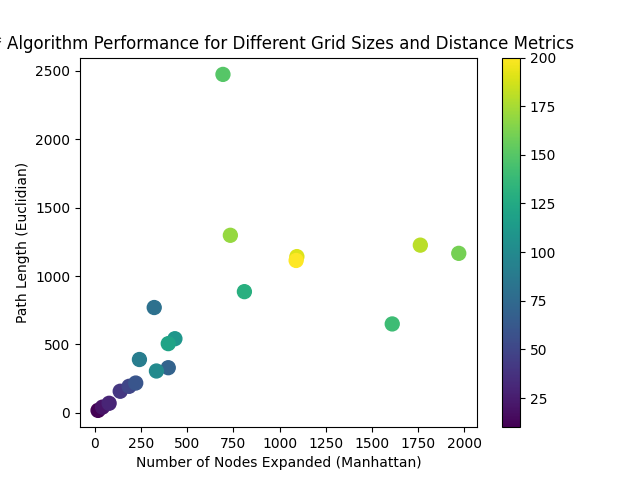

The scatter plot shows the relationship between the number of nodes expanded and the path length for various grid sizes and distance metrics. As the grid size increases, the number of nodes expanded and the path length also increase, indicating a higher computational complexity. Among the distance metrics, the Manhattan distance and the Euclidean distance show a similar trend, with the number of nodes expanded and the path length increasing at a similar rate. However, the diagonal and octile distances show a significant increase in the number of nodes expanded and path length, especially for larger grid sizes. This indicates that these distance metrics may not be suitable for larger grids and can result in a significant increase in computational time. Additionally, it is observed that the octile distance metric generally results in the highest number of nodes expanded and path length, indicating a higher computational complexity compared to the other distance metrics. Overall, the scatter plot provides insights into the computational complexity of different distance metrics for pathfinding algorithms and highlights the need to carefully choose a suitable distance metric based on the grid size and requirements of the application.

## Application

### What is the A\* algorithm used for?

The A\* algorithm is a pathfinding algorithm used to find the shortest path between two nodes in a graph. It is widely used in artificial intelligence, robotics, and game development for path planning.

### Examples of A\* algorithm:

In game development, A* is used for pathfinding of non-player characters (NPCs) to navigate around obstacles and find the shortest path to their destination.
In robotics, A* is used for path planning of autonomous robots to navigate in dynamic environments and avoid obstacles.
A* is used for route planning in navigation apps, such as Google Maps and Waze, to find the shortest route between two locations.
Why is A* algorithm useful?
A\* algorithm is useful because it provides an efficient way to find the shortest path between two nodes in a graph, especially in large and complex environments. It also allows for the incorporation of different heuristics that can improve the algorithm's efficiency and accuracy.

### Different heuristics used in A\* algorithm:

Manhattan distance: also known as taxi-cab distance, it measures the distance between two points as the sum of the absolute differences of their coordinates. This heuristic is often used in grid-based environments, where movement is limited to four directions (up, down, left, right).
$${Manhattan}(p, q) = |p_x - q_x| + |p_y - q_y|$$

Euclidean distance: it measures the straight-line distance between two points in a Euclidean space. This heuristic is often used in continuous environments, where movement can occur in any direction.

$${Euclidean}(p, q) = \sqrt{(p_x - q_x)^2 + (p_y - q_y)^2}$$
Diagonal distance: it is similar to Manhattan distance but allows diagonal movement as well. This heuristic is often used in grid-based environments, where movement is allowed in eight directions (up, down, left, right, and diagonals).

$${Diagonal}(p, q) = \sqrt{2} \cdot {Manhattan}(p, q)$$

Octile distance: it is a combination of diagonal and Manhattan distance and is often used in grid-based environments, where movement is allowed in eight directions. This heuristic provides a more accurate estimate of the distance between two points than diagonal or Manhattan distance alone.

$${Octile}(p, q) = \max({Manhattan}(p, q), \sqrt{2} \cdot {Manhattan}(p, q))$$

## Implementation

For my project, I worked with the A\* algorithm in Python, specifically implementing different heuristics to solve a pathfinding problem on a grid. To implement the algorithm, I used the numpy library to create and manipulate the grid, as well as the heapq library to maintain a priority queue of nodes to be expanded.

One of the challenges I faced was understanding how to properly implement the different heuristics, such as the Manhattan distance and Euclidean distance, and ensuring that they were consistent with the grid structure. Another challenge was handling edge cases, such as when the start or goal nodes were blocked or inaccessible.

### Code:

#### Grid

For the actual data structure for the grid, I used a 2D Matrix. This was implemented using a grid class: \
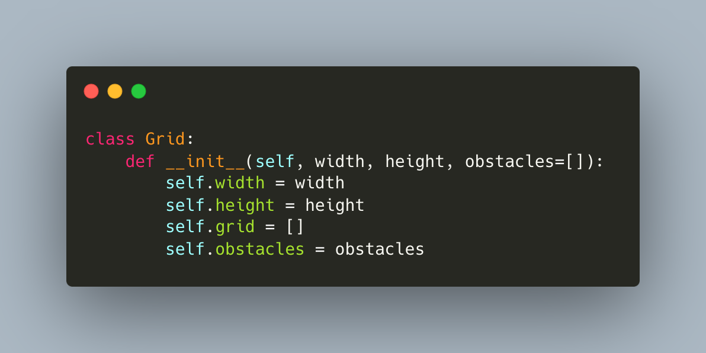

#### Cells

For storing individual cells, a Cell class was used. Each cell can have multiple flag attributes like start, end, path, open, closed etc. \
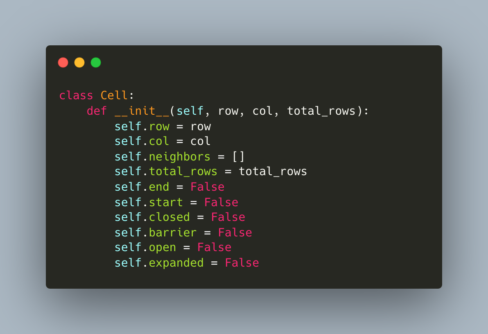

#### Algorithm

The main A star algorithm was implemented using a Priority queue. It returns the nodes seen and the actual path. The first part of it shows how it goes through all the elements in the queue. \
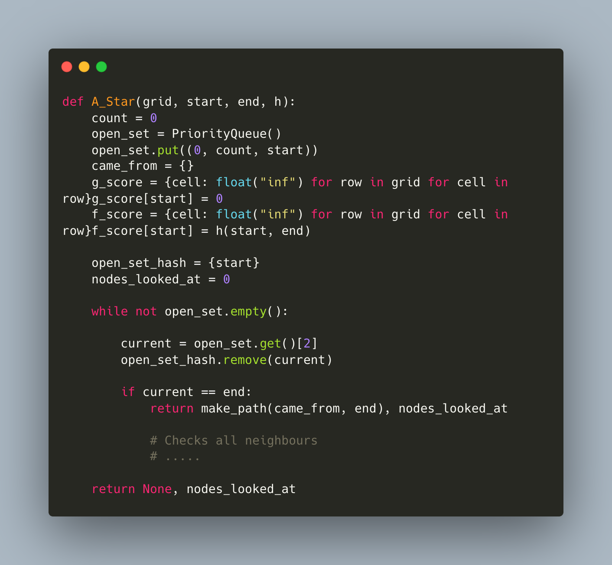

#### Searching neighbours

Then once the element of the queue with the highest priority (element with the lowest F - Score) is popped, it goes through all the neighbours of the elements and adds them to the queue to check them: \
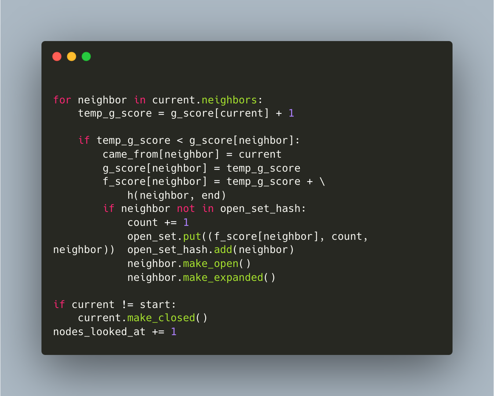

#### Getting Neighbours

The way I check neighbours for each cell is just by checking the left right top and bottom of the cell. Here I make sure to check if the neighbour is not an obstacle. \
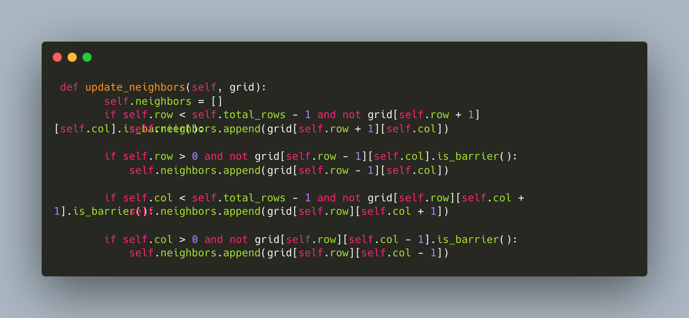

#### Heuristic Functions

For heuristic functions, I just pass the start and end node and they calculate the heuristic distance between them based on the type of heuristic function. \
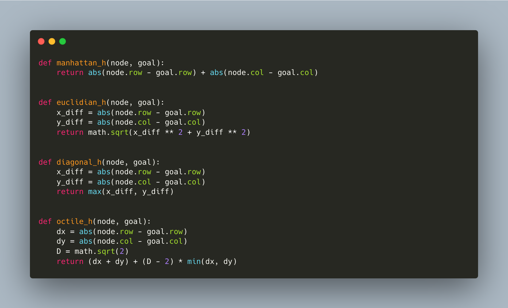

## Summary

For my project, I implemented the A* algorithm with different heuristics in Python. The main goal of my project was to analyze how the different heuristics affect the performance of the A* algorithm.

To start off, I provided an introduction to the A\* algorithm and how it works. Then, I discussed the different heuristics that can be used with the algorithm, including the Manhattan, Euclidean, Diagonal, and Octile distance heuristics. I also explained the implementation of the algorithm in Python and the libraries that I used.

Next, I presented my findings and analysis of the project. I generated scatter plots to visualize the relationship between the number of nodes expanded and the path length for different grid sizes and distance metrics. From the analysis, I found that the Octile distance heuristic performed the best in terms of both path length and number of nodes expanded. I also discussed the drawbacks and limitations of the A\* algorithm, such as its tendency to become slow and memory-intensive for larger grids.

Overall, the project was a great learning experience for me. I gained a better understanding of the A\* algorithm and how it can be used in different applications. I also learned about the different heuristics that can be used with the algorithm and how they affect its performance. Some of the challenges I faced included optimizing the code to handle larger grids and minimizing memory usage.

In conclusion, the A\* algorithm with different heuristics is a powerful tool for solving pathfinding problems. However, it is important to carefully consider the choice of heuristic and grid size to ensure optimal performance.

## Bibliography

1. One of the best ways I could understand the algorithm: https://www.youtube.com/watch?v=-L-WgKMFuhE
2. Russel, S. and Norvig, P. (2010). Artificial Intelligence: A Modern Approach. Prentice Hall.
3. Original Paper published where the A\* algorithm was discussed for the first time: https://ieeexplore.ieee.org/document/4082128
4. C++ code for A\* algorithm implementation: https://www.geeksforgeeks.org/a-search-algorithm/
5. Python implementation of A\* algorithm using heapq library: https://gist.github.com/jamiees2/5531924
6. Python implementation of A\* algorithm using priority queue: https://github.com/nbro/Python-A-Star
7. Explanation of Manhattan, Euclidean, Diagonal and Octile distance metrics: http://theory.stanford.edu/~amitp/GameProgramming/Heuristics.html
8. Python implementation of A\* algorithm with different heuristics: https://www.redblobgames.com/pathfinding/a-star/implementation.html
9. Article on the limitations of A\* algorithm: https://www.redblobgames.com/pathfinding/a-star/limitations.html
10. Cormen, T. H., Leiserson, C. E., Rivest, R. L., & Stein, C. (2009). Introduction to algorithms (3rd ed.). Cambridge, MA: MIT Press.

[Pathfinding]: https://en.wikipedia.org/wiki/Pathfinding#:~:text=Pathfinding%20or%20pathing%20is%20the,path%20on%20a%20weighted%20graph.
[A\*]: https://en.wikipedia.org/wiki/A*_search_algorithm
[A*]: https://en.wikipedia.org/wiki/A*_search_algorithm
[Dijkstra's]: https://en.wikipedia.org/wiki/Dijkstra%27s_algorithm
[Heuristic]: https://en.wikipedia.org/wiki/Heuristic_(computer_science)
[1968]: https://ieeexplore.ieee.org/document/4082128
[Euclidean]: https://webdocs.cs.ualberta.ca/~bowling/papers/11aaai-heuristicopt.pdf
[Manhattan]: https://www.sciencedirect.com/topics/computer-science/manhattan-distance#:~:text=A%20common%20heuristic%20function%20for,these%20values%20over%20all%20tiles.
[Chebyshev]: https://en.wikipedia.org/wiki/Chebyshev_distance
[Octile]: https://www.sciencedirect.com/science/article/pii/S1000936116301182#:~:text=The%20octile%20distance%20between%20p,%7C%20y%20%2D%20y%20%E2%80%B2%20%7C%20.
[Diagnol]: http://theory.stanford.edu/~amitp/GameProgramming/Heuristics.html
[Terminal-Color-Codes]: https://www.lihaoyi.com/post/BuildyourownCommandLinewithANSIescapecodes.html
[branchind-factor]: https://en.wikipedia.org/wiki/Branching_factor
[iterative-deepening]: https://www.geeksforgeeks.org/iterative-deepening-searchids-iterative-deepening-depth-first-searchiddfs/
[memory-bound-search]: https://cse.sc.edu/~mgv/csce580f11/gradPres/580f11SiminFahimIDAStar.pdf
